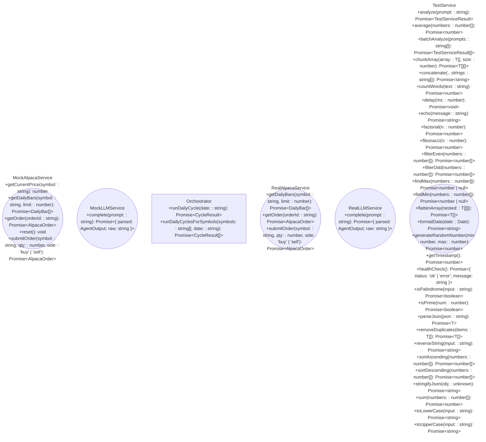

<!-- AUTO-GENERATED FILE - DO NOT EDIT -->
<!-- This file is generated by the Zan VS Code extension -->

# Architecture

Generated: 2026-02-02T16:43:52.096Z

## Analyzed Files

- `src/agents/confirmation.ts`
- `src/agents/meanReversion.ts`
- `src/agents/momentum.ts`
- `src/config.ts`
- `src/core/aggregator.ts`
- `src/core/orchestrator.ts`
- `src/core/riskManager.ts`
- `src/core/technicals.ts`
- `src/index.ts`
- `src/prompts.ts`
- `src/services/alpaca.mock.ts`
- `src/services/alpaca.ts`
- `src/services/db.ts`
- `src/services/llm.mock.ts`
- `src/services/llm.ts`
- `src/services/test.service.ts`
- `src/types.ts`

## Component Diagram

